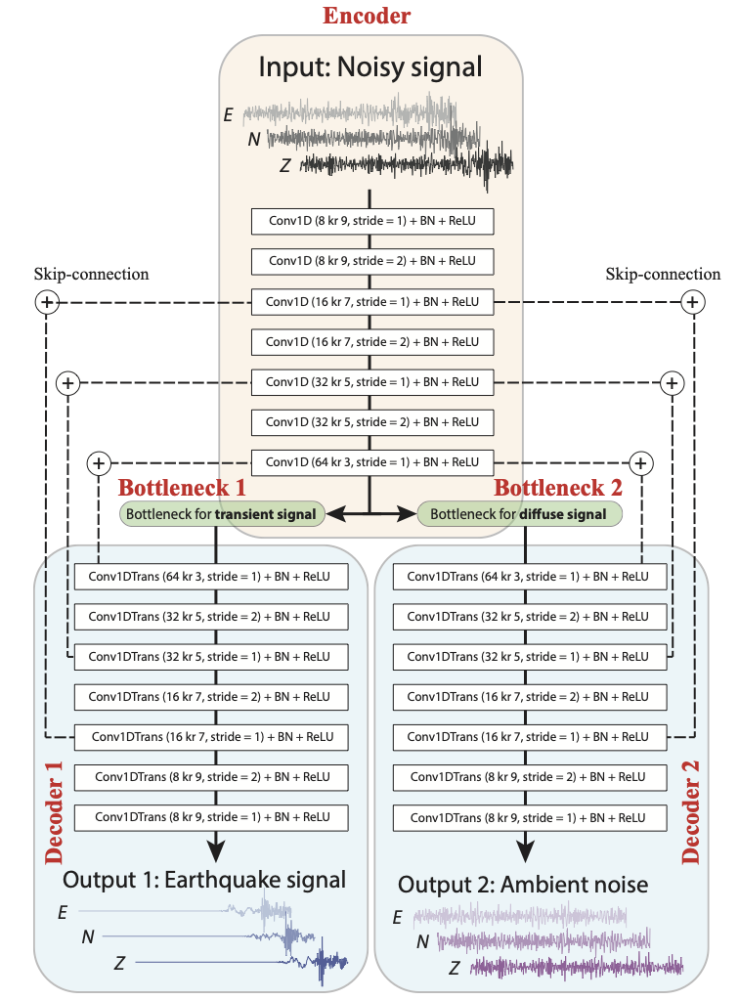

# WaveDecompNet

A machine learning tool to separate earthquake and ambient noise signals for the seismic data in time domain.



 
1. Install to "WaveDecompNet" virtual envirionment
```bash
conda env create -f environment.yml
conda activate WaveDecompNet
```

2. make a directory called training_datasets in the current folder,
download the prepared data from https://drive.google.com/file/d/1zzlzZr8kV3BdNhIm6q4c1rDi-4XdRNi6/view?usp=sharing 
and move it to training_datasets


3. Train the model
```bash
python train_model.py
```

4. A pre-trained model is in folder /Branch_Encoder_Decoder_LSTM and can be directly tested with the downloaded data
```bash
python test_model.py
```