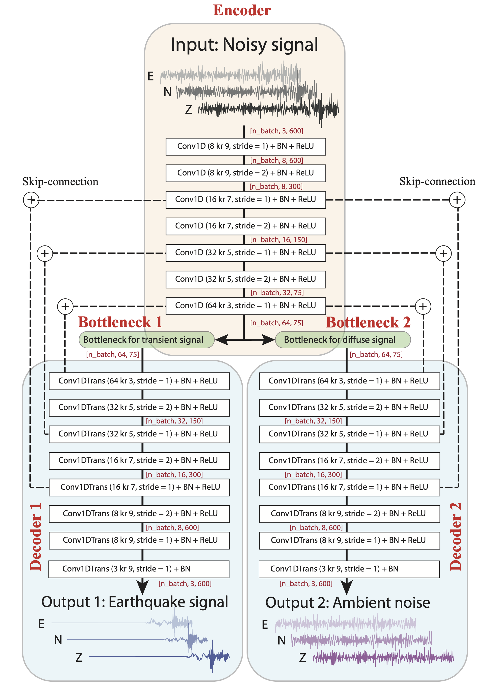

# WaveDecompNet

A machine learning tool to separate earthquake and ambient noise signals for the seismic data in time domain.



 
1. Install to "WaveDecompNet" virtual envirionment
```bash
conda env create -f environment.yml
conda activate WaveDecompNet
```

2. make a directory called training_datasets in the current folder,
download the prepared data from https://www.dropbox.com/s/5frrvx9elzudemt/training_datasets_all_snr_40_unshuffled.hdf5?dl=0 
and move it to training_datasets


3. Train the model
```bash
python train_model.py
```

4. A pre-trained model is in folder /Branch_Encoder_Decoder_LSTM and can be directly tested with the downloaded data
```bash
python test_model.py
```

There is a notebook showing a example of how to apply the trained model to continous seismic data of IU.POHA and HV.HAT in the folder ./notebooks/
